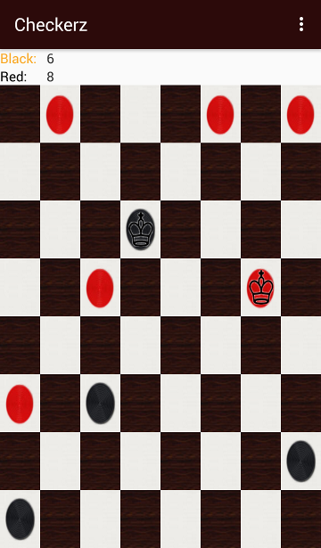

# Checkerz

A Mobile Game of Checkers for Android

- Play with your friends or test your skill against **Checkerz Bot**!

## Starting a game

Click on the Menu icon at the top right of the app. You have the option to play against

- Another player via hotseat or
- Checkerz Bot

## Rules

Checkerz rules are simple, each color can move one piece forward one square in either diagonal direction. If an opponent's piece should be in this position instead, the player may jump over this piece if the position beyond the opponent is empty. Evey piece that is jumped over in this way is condidered captured. A player wins the game when the opponent is unable to make another move, either because their pieces are blocked because every one of their pieces has been captured.

## Crowning

When either player's piece reaches the opposite side of the board, it is crowned and the icon is replaced with the one above. This player's turn then ends. Crowned pieces are allowed to move both toward and away from their opponents side of the game board.

